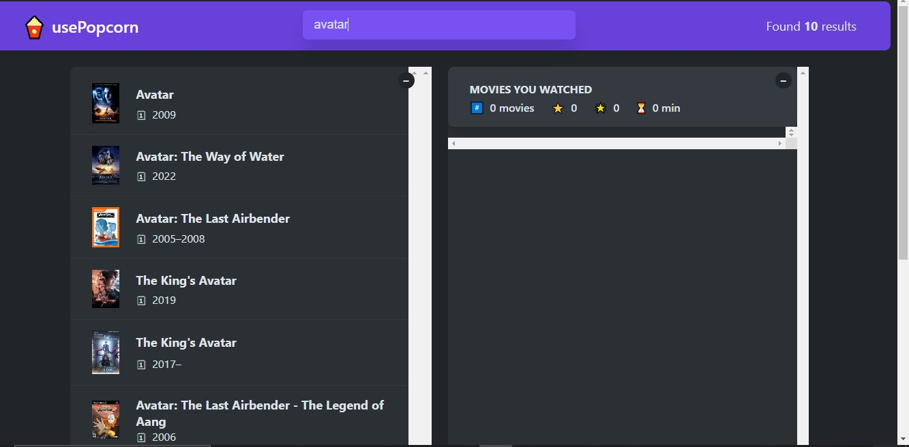

# The usePopCorn App

- This project was built to understand the concept of the react hook better.
- It's fetches it data form an api [https://www.omdbapi.com/].
- Live link [https://use-pop-corn-pi.vercel.app/].

The Demo version -

